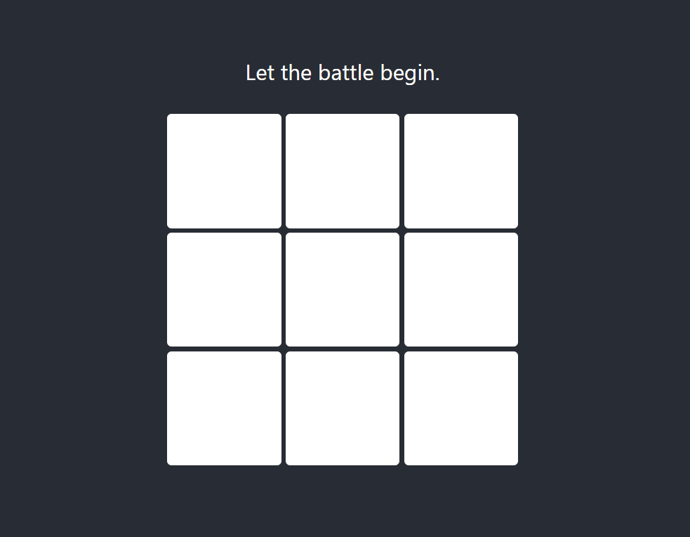

# React Tic-Tac-Toe

## 20.10.2022

Implemented basic functionality.

* Implemented card flip using [this tutorial](https://www.w3schools.com/howto/howto_css_flip_card.asp)
* Used After Effects to create stoke. First used [this tutorial](https://www.youtube.com/watch?v=_Xg4KHNlmPI) to create brush animation and export as AVI. Second, converted to WEBP and to series of PNG by [ezgif tool](https://ezgif.com/video-to-webp). Third, added timeout using [this tutorial](https://upmostly.com/tutorials/settimeout-in-react-components-using-hooks).

